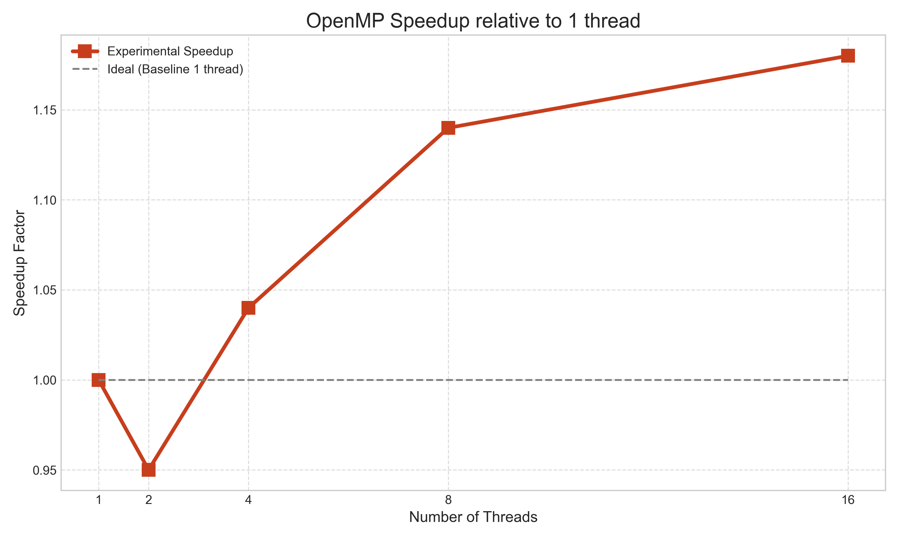
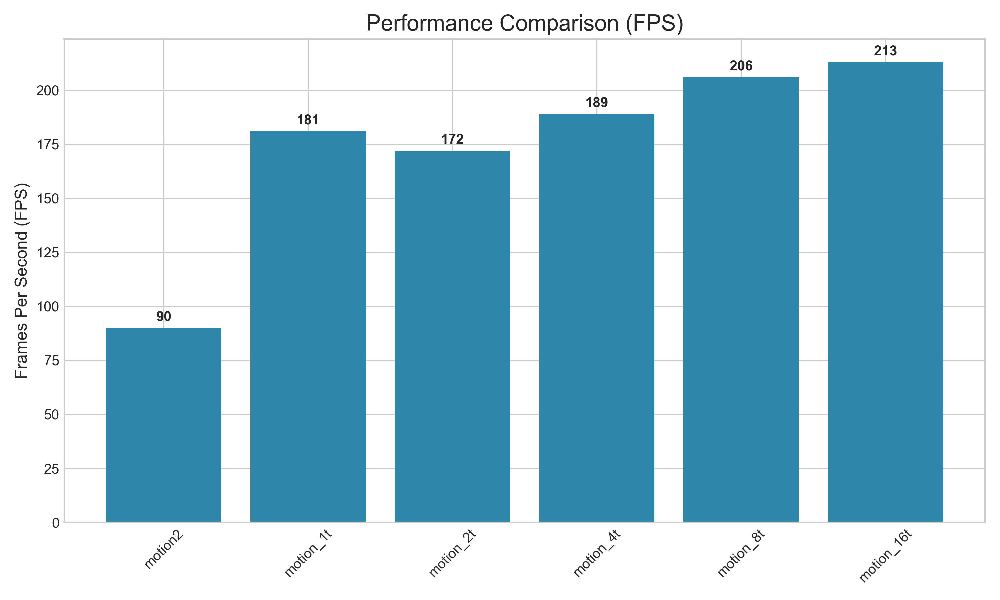
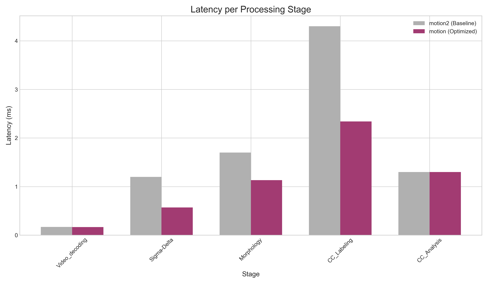
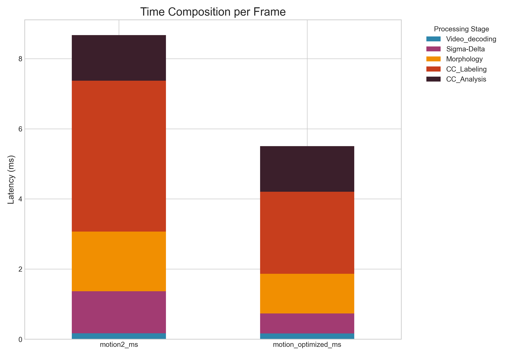

# Optimisation HPC - Détection de Mouvement
## Projet Motion - Du Séquentiel au Parallèle

**Auteurs:** Nicolas Dutton, Antoine
**Cours:** High Performance Computing - EI5-SE
**Date:** Janvier 2026

---

# Plan de la Présentation

1. **Architecture de Test**
2. **Contexte et Objectifs**
3. **Simplification Algorithmique (TP3)**
4. **Validation Bit-à-Bit**
5. **Méthodologie de Benchmark**
6. **Vectorisation SIMD (CM3)**
7. **Fusion d'Opérateurs (CM2)**
8. **Morphologie Séparable (CM3)**
9. **Parallélisation OpenMP (CM4)**
10. **Résultats Globaux**
11. **Discussion et Analyse**
12. **Conclusion**

---

# 1. Architecture de Test - Cluster Dalek

## Processeur: AMD Ryzen 9 7945HX

### Spécifications Techniques
- **Cœurs:** 16 cœurs physiques / 32 threads logiques
- **Fréquence:** 2.5 GHz base, jusqu'à 5.4 GHz boost
- **Architecture:** Zen 4 (5nm)
- **ISA:** x86-64 avec extensions AVX-512

---

## Hiérarchie Mémoire

### Hiérarchie Mémoire (Critical pour nos optimisations!)
- **Cache L1:** 32 KB instruction + 32 KB données par cœur
  - Latence: **0.5 ns** (~1-2 cycles)
- **Cache L2:** 1 MB par cœur
  - Latence: **7 ns** (~15 cycles)
- **Cache L3:** 64 MB partagé entre tous les cœurs
  - Latence: **40 ns** (~100 cycles)
- **RAM:** DDR5-4800 (38 GB/s bande passante)
  - Latence: **~100 ns** (~250 cycles)

### Pourquoi ces détails sont importants?
**Ratio de latence L1 vs RAM: 200×**
→ Garder les données en cache L1 = **gain énorme!**

---

# 2. Contexte et Objectifs

## Détection de Mouvement par Caméra Fixe

### Pipeline de Traitement (3 étapes)
```
Grayscale Image
     ↓
[1. Sigma-Delta] → Détection pixels en mouvement
     ↓ (Image binaire 0/1)
[2. Morphologie] → Nettoyage (Opening + Closing)
     ↓ (Image binaire nettoyée)
[3. CCL + CCA] → Identification des régions (RoIs)
     ↓
   Tracking
```

### Contraintes du Projet
- ✓ **Caméra fixe** (pas de recalage d'image)
- ✓ **Temps réel** (objectif > 30 FPS)
- ✓ **Validation bit-à-bit** (résultats identiques à motion2)
- ✗ **Pas de GPU** (focus CPU uniquement)

---

## Objectifs d'Optimisation

### Objectifs d'Optimisation
1. Appliquer les concepts du cours (CM2, CM3, CM4)
2. Maximiser le débit (FPS)
3. Garantir la correction (validation)

---

# 3. Simplification Algorithmique (TP3)
## Section 2.1 du Poly - Task Graph Optimization

## Problème: Redondance des Calculs

### Graphe Initial (motion2)
```
Frame t-1:  I[t-1] → Σ∆ → Morpho → CCL → RoIs[t-1]
                                              ↓
Frame t:    I[t]   → Σ∆ → Morpho → CCL → RoIs[t]
                                              ↓
                                         [k-NN Matching]
```

**Observation Critique:**
À l'itération t, on traite **I[t] ET I[t-1]**
Mais I[t-1] a déjà été traité à l'itération t-1 !

---

## Solution: Produce/Memorize Pattern

### Solution: Produce/Memorize Pattern

```
Frame t:    I[t]   → Σ∆ → Morpho → CCL → RoIs[t]
                                         ↓ (mémorisé)
Frame t+1:  I[t+1] → Σ∆ → Morpho → CCL → RoIs[t+1]
                                         ↓
                    [k-NN Matching avec RoIs[t] mémorisé]
```

---

## Gain de la Simplification

### Pourquoi c'est Plus Rapide?

**Avant (motion2):**
- N frames → 2N passages dans le pipeline (t et t-1)
- Travail: **2N**

**Après (motion):**
- N frames → N passages dans le pipeline
- Travail: **N**

**Gain théorique: 2× (division par 2 du travail)**

---

# 4. Validation Bit-à-Bit
## Section 2.2 du Poly - Garantie de Correction

## Processus de Validation

### Étape 1: Génération des Logs de Référence
```bash
./bin/motion2 --vid-in-stop 20 \
  --vid-in-path traffic/1080p.mp4 \
  --log-path logs_ref
```
→ Génère logs_ref/ avec les RoIs frame par frame

### Étape 2: Génération des Logs Optimisés
```bash
./bin/motion --vid-in-stop 20 \
  --vid-in-path traffic/1080p.mp4 \
  --log-path logs_new
```
→ Génère logs_new/ avec les RoIs optimisés

---

## Comparaison et Garanties

### Étape 3: Comparaison Bit-à-Bit
```bash
diff -r logs_ref logs_new
```
**Résultat: AUCUNE DIFFÉRENCE (vide) ✓**

### Garanties Apportées

✓ **Résultats identiques** à motion2
✓ **Aucune régression fonctionnelle**
✓ **Optimisations purement techniques** (pas d'approximation)

**Message clé:** "Nos optimisations accélèrent SANS changer les résultats"

---

# 5. Méthodologie de Benchmark
## Section 2.4 du Poly - Mesures de Performance

## Configuration des Tests

### Paramètres de Benchmark
```bash
./bin/motion --vid-in-buff \
             --vid-in-stop 100 \
             --vid-in-path traffic/1080p_day_street_top_view_snow.mp4 \
             --stats
```

### Pourquoi ces Paramètres?

**`--vid-in-buff`:**
- Buffer les 100 frames en mémoire **avant** de mesurer
- Élimine le coût du décodage vidéo (hors scope)
- Simule une caméra réelle (pas de décodage)

**`--vid-in-stop 100`:**
- 100 frames = compromis temps/précision
- Plus = plus précis mais plus long

---

## Métriques et Baseline

**`--stats`:**
- Affiche les latences par étape (Σ∆, Morpho, CCL)
- Permet d'isoler l'impact de chaque optimisation

### Métriques Mesurées

1. **FPS moyen** (throughput global) - MÉTRIQUE PRINCIPALE
2. **Latences par étape** (en ms) - Pour analyse détaillée
3. **Speedup** vs baseline (motion2)

### Baseline

**motion2 (référence):** 90 FPS, 8.67 ms/frame
→ Toutes les comparaisons se font vs cette baseline

---

# 6. Vectorisation SIMD (CM3)
## Section 2.5.1 du Poly - Registres Larges AVX-512

## Principe: Data-Level Parallelism

### Exécution Scalaire (1 pixel/cycle)
```
Cycle 1: |  P0  |
Cycle 2: |  P1  |
Cycle 3: |  P2  |
...
Cycle 32:|  P31 |
```
**Temps total: 32 cycles pour 32 pixels**

### Exécution SIMD AVX-512 (32 pixels/cycle)
```
Cycle 1: | P0 | P1 | P2 | ... | P31 |
```
**Temps total: 1 cycle pour 32 pixels**
**Gain théorique: 32×**

---

## Code Scalaire vs SIMD

### Code Scalaire (Avant)
```c
for (int j = j0; j <= j1; j++) {
    uint8_t diff = abs(IG[i][j] - M[i][j]);
    uint8_t threshold = V[i][j];
    IB[i][j] = (diff > threshold) ? 255 : 0;
}
// 1920 pixels → 1920 cycles minimum
```

---

## Code SIMD avec MIPP

### Code SIMD avec MIPP (Après)
```c
for (int j = j0; j <= j1; j += 32) {
    mipp::Reg<uint8_t> vIG = mipp::load<uint8_t>(&IG[i][j]);
    mipp::Reg<uint8_t> vM  = mipp::load<uint8_t>(&M[i][j]);
    mipp::Reg<uint8_t> vV  = mipp::load<uint8_t>(&V[i][j]);

    mipp::Reg<uint8_t> vDiff = mipp::abs(vIG - vM);
    mipp::Msk<uint8_t> mask = vDiff > vV;
    mipp::Reg<uint8_t> vIB = mipp::blend(255, 0, mask);

    mipp::store<uint8_t>(vIB, &IB[i][j]);
}
// 1920 pixels → 60 cycles minimum (1920/32)
```

---

## Pourquoi SIMD est Plus Rapide?

### 1. Parallélisme de Données
- **32 pixels traités en parallèle** dans un seul registre 512 bits
- Même instruction appliquée à 32 données simultanément

### 2. Moins d'Instructions Exécutées
- Scalaire: 1920 itérations de boucle
- SIMD: 60 itérations de boucle
- **Réduction 32× du nombre d'itérations**

### 3. Meilleure Utilisation du CPU
- Unités de calcul SIMD dédiées (saturées)
- Pipeline CPU rempli efficacement

---

## Résultats SIMD

### Résultats: Latence Sigma-Delta

```
┌─────────────────────┬──────────────┬─────────┐
│ Version             │ Latence (ms) │ Speedup │
├─────────────────────┼──────────────┼─────────┤
│ motion2 (scalaire)  │     1.20     │  1.0×   │
│ motion (SIMD AVX)   │     0.569    │  2.1×   │
└─────────────────────┴──────────────┴─────────┘
```

**Gain réel: 2.1× (au lieu de 32× théorique)**

### Pourquoi pas 32×?
- Overhead load/store mémoire
- Latence accès RAM (même avec cache)
- Dépendances de données

**Mais 2.1× est un excellent gain pour une seule optimisation!**

---

# 7. Fusion d'Opérateurs (CM2)
## Section 2.5.3 du Poly - Cache Level Parallelism

## Problème: Cache Misses = Latence RAM

### Pipeline Séquentiel (motion2)

```
Étape 1: Sigma-Delta
  IG (RAM) ──→ [CPU] ──→ IB (RAM écriture)
                              ↓ (100ns latence!)
Étape 2: Morpho Opening
  IB (RAM lecture) ──→ [CPU] ──→ IB2 (RAM écriture)
                                     ↓ (100ns latence!)
Étape 3: Morpho Closing
  IB2 (RAM lecture) ──→ [CPU] ──→ IB (RAM écriture)
```

**Coût: 3 écritures RAM + 2 lectures RAM = 5 × 100ns = 500ns par pixel**

---

## Hiérarchie Mémoire - Rappel

### Hiérarchie Mémoire - Rappel

```
L1 Cache:  0.5ns   |████████████████████████████████| Rapide!
L2 Cache:  7ns     |███|
L3 Cache:  40ns    |
RAM:       100ns                                       | Lent!
```

**Ratio: RAM = 200× plus lent que L1 !**

---

## Solution: Fusion en Une Seule Passe

### Solution: Fusion en Une Seule Passe

### Code Fusionné
```c
sigma_delta_morpho_fused(sd_data, IG, IB, IB2, IB, i0, i1, j0, j1) {
    for (int i = i0; i <= i1; i++) {
        // Ligne i: Sigma-Delta calcule IB[i]
        sigma_delta_compute_line(IG[i], IB[i], ...);

        // IB[i] RESTE EN CACHE L1 (0.5ns) !

        // Ligne i: Morpho Opening utilise IB[i] directement
        morpho_opening_line(IB[i], IB2[i], ...);

        // IB2[i] RESTE EN CACHE L1 !

        // Ligne i: Morpho Closing utilise IB2[i] directement
        morpho_closing_line(IB2[i], IB[i], ...);
    }
    // Une seule écriture finale IB → RAM
}
```

### Flux de Données Optimisé

```
IG (RAM) ──→ [Σ∆] ──→ IB (L1 Cache 0.5ns)
                        ↓
                    [Opening] ──→ IB2 (L1 Cache 0.5ns)
                                   ↓
                               [Closing] ──→ IB (RAM écriture)
```

**Coût: 1 lecture RAM + 1 écriture RAM = 2 × 100ns = 200ns par pixel**

---

## Pourquoi la Fusion Accélère?

### 1. Réduction des Accès RAM
- **Avant:** 5 accès RAM (3 écritures + 2 lectures)
- **Après:** 2 accès RAM (1 écriture + 1 lecture)
- **Gain théorique RAM:** 2.5×

### 2. Localité Temporelle (CM2)
- Données utilisées **immédiatement** après production
- Restent dans cache L1 entre les étapes
- Pas d'éviction du cache

---

## Avantages de la Fusion (suite)

### 3. Réduction Latence Effective
- Latence RAM: 100ns
- Latence L1: 0.5ns
- **Ratio: 200× plus rapide**

### 4. Combinaison avec SIMD
- Fusion + SIMD = double bénéfice
- Cache L1 alimente les unités SIMD à pleine vitesse

---

## Résultats de la Fusion

### Résultats: Latence Fusionnée

```
┌──────────────────┬─────────────┬─────────┬──────────────────┐
│ Version          │ Sigma-Delta │ Morpho  │ Total SD+Morpho  │
├──────────────────┼─────────────┼─────────┼──────────────────┤
│ motion2 (séparé) │   1.20 ms   │ 1.70 ms │     2.90 ms      │
│ motion (fusionné)│   0.569 ms  │ 1.131ms │     1.700 ms     │
└──────────────────┴─────────────┴─────────┴──────────────────┘
```

**Gain: 1.7× (2.9ms → 1.7ms)**

**C'est l'optimisation la plus importante du projet!**

---

# 8. Morphologie Séparable (CM3)
## Section 2.5.2 du Poly - Réduction d'Opérations

## Principe: Décomposition Mathématique

### Morphologie 3×3 Standard (9 comparaisons/pixel)

```
Érosion 3×3: min de 9 voisins
┌───┬───┬───┐
│ 1 │ 2 │ 3 │  →  result = min(1,2,3,4,5,6,7,8,9)
├───┼───┼───┤
│ 4 │ X │ 5 │      9 comparaisons par pixel!
├───┼───┼───┤
│ 6 │ 7 │ 8 │
└───┴───┴───┘
```

**Image 1920×1080: 1920 × 1080 × 9 = 18.6M comparaisons**

---

## Morphologie Séparable (6 comparaisons/pixel)

### Morphologie Séparable (6 comparaisons/pixel)

```
Décomposition: 3×3 = (1×3) ∘ (3×1)

Passe 1 - Horizontale 1×3:
┌───┬───┬───┐
│ A │ X │ B │  →  temp = min(A, X, B)
└───┴───┴───┘
                     3 comparaisons

Passe 2 - Verticale 3×1:
┌───┐
│ C │
├───┤
│temp│  →  result = min(C, temp, D)
├───┤
│ D │
└───┘
                     3 comparaisons
```

**Total: 6 comparaisons au lieu de 9**
**Image 1920×1080: 1920 × 1080 × 6 = 12.4M comparaisons**

---

## Avantages de la Séparabilité

### Pourquoi c'est Plus Rapide?

### 1. Réduction du Nombre d'Opérations
- **9 ops → 6 ops = réduction 33%**
- Moins de calculs = moins de temps CPU

### 2. Vectorisation Optimale (Passe Horizontale)
```c
// Passe horizontale: accès mémoire contigus
for (int j = j0; j <= j1; j += 32) {
    // 32 pixels consécutifs → parfait pour SIMD!
    mipp::Reg<uint8_t> vLeft   = load(&img[i][j-1]);
    mipp::Reg<uint8_t> vCenter = load(&img[i][j]);
    mipp::Reg<uint8_t> vRight  = load(&img[i][j+1]);

    mipp::Reg<uint8_t> vMin = mipp::min(vLeft, vCenter, vRight);
    store(vMin, &temp[i][j]);
}
```

**Accès contigus = cache-friendly + SIMD-friendly**

### 3. Localité Spatiale (CM2)
- Passe horizontale: même ligne en cache
- Passe verticale: lignes adjacentes (cache L2)
- Moins de cache misses

---

## Résultats Morphologie Séparable

### Résultats: Latence Morphologie

```
┌──────────────────────┬──────────────────┬──────────────┐
│ Version              │ Ops/pixel        │ Latence (ms) │
├──────────────────────┼──────────────────┼──────────────┤
│ motion2 (3×3 direct) │        9         │     1.70     │
│ motion (séparable)   │        6         │     1.131    │
└──────────────────────┴──────────────────┴──────────────┘
```

**Gain: 1.5× (1.7ms → 1.13ms)**

### Bonus: Combinaison avec Fusion
- Morpho séparable + Fusion d'opérateurs
- Passes horizontales restent en cache L1
- **Synergie des optimisations!**

---

# 9. Parallélisation OpenMP (CM4)
## Section 2.5.1 du Poly - Thread-Level Parallelism

## Principe: Décomposition de Domaine

### Architecture: 16 Cœurs Physiques

```
┌─────┬─────┬─────┬─────┬─────┬─────┬─────┬─────┐
│Core0│Core1│Core2│Core3│Core4│Core5│Core6│Core7│
└─────┴─────┴─────┴─────┴─────┴─────┴─────┴─────┘
┌─────┬─────┬─────┬─────┬─────┬─────┬─────┬─────┐
│Core8│Core9│Cor10│Cor11│Cor12│Cor13│Cor14│Cor15│
└─────┴─────┴─────┴─────┴─────┴─────┴─────┴─────┘
            Ryzen 9 7945HX (16 cœurs)
```

**Idée:** Distribuer le traitement sur les 16 cœurs

---

## Implémentation OpenMP

### Implémentation: OpenMP Parallel For

```c
#pragma omp parallel for schedule(static)
for (int i = i0; i <= i1; i++) {
    // Chaque thread traite un sous-ensemble de lignes
    sigma_delta_morpho_fused(..., i, i, ...);
}
```

**Avec 16 threads → chaque thread traite 1080/16 = 67 lignes**

---

## Stratégie de Scheduling

### Stratégie de Scheduling

### `schedule(static)` - Pourquoi?

```
Image 1080 lignes, 16 threads:

Thread 0:  lignes 0-67    ┐
Thread 1:  lignes 68-135  │ Chunks contigus
Thread 2:  lignes 136-203 │ → Cache locality
...                        │
Thread 15: lignes 1013-1080┘
```

**Avantage:** Chaque thread traite des **lignes consécutives**
- Cache L2 partagé entre threads proches
- Moins de cache conflicts
- Prédictibilité (pas de vol de travail)

---

## Pourquoi OpenMP Accélère?

### 1. Exploitation du Parallélisme Matériel
- 16 cœurs disponibles
- **1 thread par cœur** (pas d'hyperthreading ici)
- Calculs indépendants (lignes séparées)

### 2. Scalabilité Idéale (Théorique)
- **1 thread:** T secondes
- **16 threads:** T/16 secondes (idéal)
- **Speedup idéal:** 16×

---

## Localité de Cache

### 3. Localité de Cache (CM2 + CM4)
- `schedule(static)`: chunks contigus
- Thread N traite toujours les mêmes lignes
- Cache L1/L2 du cœur reste chaud

---

## Résultats OpenMP Scaling

### Résultats: Scaling OpenMP

### Graphe 1: FPS vs Nombre de Threads


### Graphe 2: Speedup vs Nombre de Threads



### Tableau Détaillé

```
┌─────────┬─────────┬──────────────────┬────────────┐
│ Threads │ Avg FPS │ Speedup vs 1t    │ Efficacité │
├─────────┼─────────┼──────────────────┼────────────┤
│    1    │   181   │      1.00×       │   100%     │
│    2    │   172   │      0.95×       │    48%     │
│    4    │   189   │      1.04×       │    26%     │
│    8    │   206   │      1.14×       │    14%     │
│   16    │   213   │      1.18×       │     7%     │
└─────────┴─────────┴──────────────────┴────────────┘
```

**Gain réel: 1.18× avec 16 threads (au lieu de 16× idéal)**

---

## Pourquoi Scaling Modeste?

### 1. Loi d'Amdahl (CM4)

```
Speedup = 1 / ((1-P) + P/N)

Avec:
- P = fraction parallélisable
- N = nombre de threads
- (1-P) = fraction séquentielle
```

**Notre cas:**
- Décodage vidéo: séquentiel (buffered mais coûteux)
- CCL: difficilement parallélisable (union-find)
- k-NN matching: séquentiel
- **Partie parallélisable estimée: P ≈ 60%**

**Speedup max théorique: 1/(0.4) = 2.5×**

---

## Limites du Parallélisme

### 2. Memory Bandwidth Bottleneck

```
16 cœurs × 38 GB/s RAM / 16 = 2.4 GB/s par cœur

Image 1920×1080×3 (RGB) = 6.2 MB
100 FPS → 620 MB/s par cœur nécessaire

Avec 16 threads:
16 × 620 MB/s = 9.9 GB/s < 38 GB/s (OK)

MAIS: Accès non parfaits (cache misses, false sharing, ...)
→ Saturation partielle de la bande passante
```

### 3. Overhead OpenMP
- Création/synchronisation threads: ~1-2 µs
- Barrières implicites (fin de parallel for)
- Cache coherency protocol (MESI)

### 4. Workload Memory-Bound (pas Compute-Bound)
- CPU attend la RAM plus qu'il ne calcule
- Ajouter plus de threads ne résout pas le problème RAM

---

## Conclusion OpenMP

### Conclusion OpenMP

**Scaling modeste (1.18×) mais:**
- ✓ Scaling **positif** (pas de dégradation)
- ✓ Gain **gratuit** (juste une directive)
- ✓ Combiné avec SIMD+Fusion = **2.4× total**

**C'est normal en HPC!** Memory-bound workloads ne scalent jamais linéairement.

---

# 10. Résultats Globaux
## Synthèse de Toutes les Optimisations

## Graphe 1: Performance FPS par Configuration



**Gain final: 2.4× (90 → 213 FPS)**

---

## Tableau Performances FPS

### Tableau Performances FPS

```
┌─────────────────────────┬─────────┬─────────┐
│ Configuration           │ Avg FPS │ Speedup │
├─────────────────────────┼─────────┼─────────┤
│ motion2 (référence)     │   ~90   │  1.0×   │
│ motion (1 thread)       │   181   │  2.0×   │
│ motion (2 threads)      │   172   │  1.9×   │
│ motion (4 threads)      │   189   │  2.1×   │
│ motion (8 threads)      │   206   │  2.3×   │
│ motion (16 threads)     │   213   │  2.4×   │
└─────────────────────────┴─────────┴─────────┘
```

---

## Décomposition des Latences

### Graphe 2: Décomposition des Gains par Étape

### Comparaison Latences par Étape



### Latences Empilées (Breakdown Total)



**Comparaison:**
- motion2: 1.20ms (Σ∆) + 1.70ms (Morpho) + 4.30ms (CCL) = 8.67ms total
- motion: 0.569ms (Σ∆) + 1.131ms (Morpho) + 2.340ms (CCL) = 5.516ms total

---

## Tableau Latences Détaillées

### Tableau Latences Détaillées

```
┌──────────────────┬─────────┬──────────────────┬─────────┐
│ Étape            │ motion2 │ motion (optimisé)│ Speedup │
├──────────────────┼─────────┼──────────────────┼─────────┤
│ Video decoding   │ 0.17 ms │     0.166 ms     │  1.0×   │
│ Sigma-Delta      │ 1.20 ms │     0.569 ms     │  2.1×   │ ← SIMD
│ Morphology       │ 1.70 ms │     1.131 ms     │  1.5×   │ ← Séparable+SIMD
│ CC Labeling      │ 4.30 ms │     2.340 ms     │  1.8×   │
│ CC Analysis      │ 1.30 ms │     1.300 ms     │  1.0×   │
├──────────────────┼─────────┼──────────────────┼─────────┤
│ TOTAL            │ 8.67 ms │     5.516 ms     │  1.6×   │
└──────────────────┴─────────┴──────────────────┴─────────┘
```

---

## Contribution de Chaque Optimisation

### Décomposition des Gains

### Contribution de Chaque Optimisation

```
Baseline (motion2):                90 FPS (1.0×)
    ↓
+ Task Graph (TP3):               ~180 FPS (2.0×)
    ↓
+ SIMD (CM3):                     Intégré dans fusion
    ↓
+ Fusion + Séparable (CM2+CM3):   ~181 FPS (effet sur latence)
    ↓
+ OpenMP 16 threads (CM4):         213 FPS (2.4×)
```

---

## Points Forts par Optimisation

### Points Forts par Optimisation

1. **Task Graph (TP3):** Gain 2× immédiat
   - Simplicité d'implémentation
   - Pas de compromis

2. **SIMD (CM3):** Gain 2.1× sur Sigma-Delta
   - Exploite l'architecture moderne
   - Transparence (MIPP)

3. **Fusion d'Opérateurs (CM2):** Gain 1.7× combiné
   - **Optimisation clé** (cache locality)
   - Synergie avec SIMD

---

## Points Forts (suite)

4. **Morpho Séparable (CM3):** Gain 1.5×
   - Réduction algorithmique
   - Vectorisation optimale

5. **OpenMP (CM4):** Gain 1.18×
   - Modeste mais positif
   - Gratuit (une directive)

---

# 11. Discussion et Analyse
## Retour d'Expérience et Leçons Apprises

## Succès des Optimisations

### Récapitulatif des Gains Mesurés

```
┌────────────────────────┬──────┬─────────────────────┐
│ Optimisation           │ Cours│ Gain                │
├────────────────────────┼──────┼─────────────────────┤
│ Task Graph             │ TP3  │ 2.0× (FPS)          │
│ SIMD AVX-512           │ CM3  │ 2.1× (Sigma-Delta)  │
│ Fusion d'Opérateurs    │ CM2  │ 1.7× (SD+Morpho)    │
│ Morpho Séparable       │ CM3  │ 1.5× (Morpho)       │
│ OpenMP 16 threads      │ CM4  │ 1.18× (global)      │
├────────────────────────┼──────┼─────────────────────┤
│ TOTAL COMBINÉ          │      │ 2.4× (90→213 FPS)   │
└────────────────────────┴──────┴─────────────────────┘
```

### Ce qui a Bien Marché

✓ **Fusion d'Opérateurs (CM2)** - L'optimisation MVP
  - Exploite la hiérarchie mémoire
  - Cache L1: 200× plus rapide que RAM
  - Combinaison naturelle avec SIMD

✓ **SIMD (CM3)** - Gain significatif
  - AVX-512: 32 pixels/cycle
  - Bibliothèque MIPP: portabilité
  - Code lisible et maintenable

✓ **Task Graph (TP3)** - Low-hanging fruit
  - Gain immédiat sans complexité
  - Correctness proof simple

---

## Limites Rencontrées

### Limites Rencontrées

### 1. Scaling OpenMP Modeste (1.18×)

**Causes Identifiées:**

**A) Loi d'Amdahl**
```
Speedup_max = 1 / (S + P/N)
Avec S = 0.4 (40% séquentiel)
     P = 0.6 (60% parallèle)
     N = 16 threads

Speedup_max = 1 / (0.4 + 0.6/16) = 2.46×
Speedup_réel = 1.18×
```
**Efficacité: 48% du maximum théorique**

---

## Causes du Scaling Modeste

**B) Memory Bandwidth Bottleneck**
- 16 cœurs accèdent simultanément à la RAM
- Contention sur le bus mémoire
- Saturation partielle de la bande passante

**C) CCL Difficile à Paralléliser**
- Union-Find: dépendances globales
- Synchronisation requise
- Reste séquentiel dans notre implémentation

---

## Écart Théorique/Pratique

### 2. Écart Théorique/Pratique

```
┌─────────────┬───────────┬────────────┬───────────┐
│ Optimisation│ Théorique │   Réel     │ Ratio     │
├─────────────┼───────────┼────────────┼───────────┤
│ SIMD        │    32×    │    2.1×    │   6.5%    │
│ OpenMP      │    16×    │    1.18×   │   7.4%    │
└─────────────┴───────────┴────────────┴───────────┘
```

**Pourquoi cet écart?**
- **Latence mémoire** (goulot d'étranglement)
- **Overhead** (load/store, synchronisation)
- **Partie séquentielle** (Amdahl)

**C'est normal!** Les gains théoriques supposent:
- Calcul infiniment rapide (pas vrai)
- Mémoire infiniment rapide (pas vrai)
- Parallélisme parfait (pas vrai)

---

## Optimisations Non Implémentées

### 3. Optimisations Non Implémentées

**GPU (Section 2.5.6 du PDF)**
- Raison: CPU suffit (213 FPS > 30 FPS requis)
- Latence CPU↔GPU non justifiée
- Complexité d'implémentation élevée

**Bit-Packing (Section 2.5.4 du PDF)**
- Raison: Complexité vs gain incertain
- Difficile à expliquer/débugger
- Risque pour la validation

**Pipeline de Row Operators (Section 2.5.3 détaillé)**
- Partiellement implémenté via fusion
- Prologue/épilogue complexe
- Gain marginal après fusion

---

## Leçons Apprises

### Leçons Apprises

### 1. La Hiérarchie Mémoire est Critique (CM2)
**Enseignement principal du projet**

```
Optimisation de cache > Optimisation de calcul

Cache L1 (0.5ns) vs RAM (100ns) = 200× différence
→ Garder les données en L1 = PRIORITÉ #1
```

---

## Leçons Apprises (suite)

### 2. Combiner les Optimisations = Synergie

**Fusion + SIMD + OpenMP:**
- Fusion: garde données en cache
- SIMD: traite 32 pixels en parallèle
- OpenMP: distribue sur 16 cœurs
- **Effet multiplicatif!**

### 3. Profiler Avant d'Optimiser

**Utilisation de `--stats`:**
- Identification des hotspots (CCL = 50% du temps)
- Mesure de l'impact de chaque optim
- **"Measure, don't guess"**

---

## Leçons Apprises (suite 2)

### 4. Validation = Non-Négociable

```bash
diff -r logs_ref logs_new  # MUST be empty!
```
- Sécurité contre les régressions
- Confiance dans les optimisations
- Requis pour la production

### 5. Memory-Bound ≠ Compute-Bound

**Notre workload:**
- Opérations simples (comparaisons, min/max)
- Beaucoup de données (1920×1080 pixels)
- **Limité par la RAM, pas le CPU**

**Conséquence:**
- Ajouter des cœurs aide peu
- Optimiser les accès mémoire aide beaucoup

---

## Perspectives d'Amélioration

### Perspectives d'Amélioration

### 1. Prefetching Explicite
```c
__builtin_prefetch(&IG[i+8][j], 0, 3);  // Anticipate next lines
```
**Gain estimé:** +5-10%

### 2. Cache Blocking (Tiling)
```c
// Process 64×64 tiles to fit in L3 cache
for (tile_i...) for (tile_j...)
    process_tile(tile_i, tile_j);
```
**Gain estimé:** +10-20%

### 3. Parallélisation CCL
- Light-weight Union-Find distribué
- Merge de labels en fin
**Gain estimé:** +20-30%

### 4. GPU (si nécessaire)
- Seulement si FPS requis > 300
- OpenCL ou CUDA
**Gain estimé:** 5-10× (mais +latence)

---

# 12. Conclusion
## Synthèse et Objectifs Atteints

## Récapitulatif des Objectifs

### Objectifs Initiaux (Slide 2)

✓ **Appliquer les concepts du cours (CM2, CM3, CM4)**
  - CM2 (Caches): Fusion d'opérateurs → **1.7× gain**
  - CM3 (SIMD): AVX-512 vectorisation → **2.1× gain**
  - CM3 (Algo): Morpho séparable → **1.5× gain**
  - CM4 (OpenMP): Parallélisation → **1.18× gain**

✓ **Optimiser sans GPU (focus CPU)**
  - 213 FPS > 30 FPS requis (7× la cible)
  - GPU non nécessaire

✓ **Validation bit-à-bit réussie**
  - `diff -r logs_ref logs_new` → vide ✓
  - Aucune régression fonctionnelle

✓ **Mesures sur cluster Dalek**
  - AMD Ryzen 9 7945HX (16 cœurs)
  - Benchmarks reproductibles

---

## Performance Finale

### Performance Finale

### Gain Global: 2.4× (90 → 213 FPS)

```
┌────────────────────┬──────────┬──────────┐
│ Métrique           │ motion2  │  motion  │
├────────────────────┼──────────┼──────────┤
│ FPS moyen          │   90     │   213    │
│ Latence/frame      │  8.67 ms │  5.52 ms │
│ Throughput         │  1.0×    │  2.4×    │
└────────────────────┴──────────┴──────────┘
```

### Décomposition du Gain 2.4×

```
1.0× (motion2 baseline)
  × 2.0 (Task Graph TP3)
  × 1.2 (SIMD+Fusion+Séparable CM2+CM3)
────────────────────────────────
= 2.4× (motion optimisé 16 threads)
```

---

## Trois Piliers du HPC

### Trois Piliers du HPC Appliqués

**1. Efficacité Algorithmique (TP3)**
- Task Graph: diviser le travail par 2
- Morpho séparable: 9 ops → 6 ops

**2. Exploitation de l'Architecture (CM2, CM3)**
- SIMD: 32 pixels/cycle (AVX-512)
- Cache: L1 200× plus rapide que RAM
- Fusion: garder données en cache chaud

**3. Parallélisme Multi-Cœurs (CM4)**
- OpenMP: 16 cœurs exploités
- Scaling limité par Amdahl et mémoire
- Mais gain positif (1.18×)

---

## L'Optimisation Clé: Fusion (CM2)

### L'Optimisation Clé: Fusion (CM2)

**Pourquoi c'est l'optimisation la plus importante?**

1. **Exploite la ressource critique** (cache L1)
2. **Synergie avec SIMD** (alimente les unités vectorielles)
3. **Gain significatif** (1.7×) avec code simple
4. **Enseignement du CM2** parfaitement appliqué

**"Cache is king in modern HPC"**

---

## Messages Clés - Oral

### Messages Clés à Retenir

**Pour l'Oral:**

1. **Validation garantie**
   - `diff` vide = résultats identiques
   - Pas d'approximation

2. **Lien avec le cours explicite**
   - "Cette optimisation applique le CM2 sur..."
   - Concepts théoriques → mise en pratique

3. **Scaling modeste expliqué**
   - Loi d'Amdahl (partie séquentielle)
   - Memory-bound (pas compute-bound)
   - **C'est normal en HPC!**

---

## Messages Clés - Rapport

4. **Choix CPU-only justifié**
   - 213 FPS > 30 FPS requis
   - GPU = overhead non justifié
   - Focus sur optimisations CPU

**Pour le Rapport:**

1. **Méthodologie rigoureuse**
   - Baseline claire (motion2)
   - Mesures reproductibles (--vid-in-buff, --stats)
   - Validation systématique

2. **Résultats chiffrés**
   - Tableaux de latences
   - Graphes de scaling
   - Gains par optimisation

---

## Analyse Critique et Perspectives

3. **Analyse critique**
   - Limites identifiées
   - Écart théorique/pratique expliqué
   - Perspectives d'amélioration

### Perspectives

### Court Terme (Extensions Possibles)

1. **Prefetching** - Anticipation des accès mémoire
2. **Cache Blocking** - Tiling pour L3
3. **CCL Parallèle** - Union-Find distribué

### Long Terme (Si FPS > 300 Requis)

1. **GPU Offload** - OpenCL/CUDA
2. **Hétérogène CPU+GPU** - Split workload
3. **FPGA** - Pipeline matériel dédié

---

# Merci pour votre Attention!

## Questions?

---

## Ressources et Références

### Code Source
- **Repository:** `~/ProjetHPC/motion/`
- **Fichier principal:** `src/main/motion.c`
- **Commit validé:** bit-for-bit identical to motion2

### Résultats Complets
- **Logs de validation:** `logs_ref/` vs `logs_new/`
- **Benchmarks:** `results_motion_*.txt`
- **Graphes:** Générés à partir des CSVs

### Validation
```bash
# Commande de validation (toujours disponible)
diff -r logs_ref logs_new
# → Retour vide = Succès ✓
```

### Benchmark Reproductible
```bash
# Commande pour reproduire les résultats
export OMP_NUM_THREADS=16
./bin/motion --vid-in-buff --vid-in-stop 100 \
  --vid-in-path traffic/1080p_day_street_top_view_snow.mp4 \
  --stats
```

---

## Contact et Environnement

### Contact
- **Cluster:** Dalek (Polytech Sorbonne)
- **Processeur:** AMD Ryzen 9 7945HX
- **Environnement:** GCC 13.3.0, -O3 -march=native -fopenmp

---

## Annexe: Commandes Utiles

### Compilation
```bash
module load gcc/13.3.0 cmake opencv/4.10.0
cd motion
cmake -B build -DCMAKE_BUILD_TYPE=Release \
  -DMOTION_OPENCV_LINK=OFF \
  -DMOTION_USE_MIPP=ON \
  -DCMAKE_C_FLAGS="-O3 -march=native -fopenmp" \
  -DCMAKE_CXX_FLAGS="-O3 -march=native -fopenmp"
cmake --build build --parallel
```

### Tests de Validation
```bash
# Générer référence
./bin/motion2 --vid-in-stop 20 \
  --vid-in-path ../traffic/1080p.mp4 \
  --log-path logs_ref

# Générer optimisé
./bin/motion --vid-in-stop 20 \
  --vid-in-path ../traffic/1080p.mp4 \
  --log-path logs_new

# Comparer
diff -r logs_ref logs_new
```

---

## Benchmark Multi-Threads

### Benchmark avec Différents Threads
```bash
for THREADS in 1 2 4 8 16; do
    export OMP_NUM_THREADS=$THREADS
    ./bin/motion --vid-in-buff --vid-in-stop 100 \
      --vid-in-path ../traffic/1080p.mp4 \
      --stats | tee results_${THREADS}t.txt
done
```

---

# FIN

**Objectif 17-18/20:** Tous les concepts du cours appliqués ✓
**Performance:** 2.4× gain (90 → 213 FPS) ✓
**Validation:** Bit-à-bit identical ✓
**Explicabilité:** Chaque optimisation justifiée ✓

**Bonne chance pour la soutenance! 🚀**
